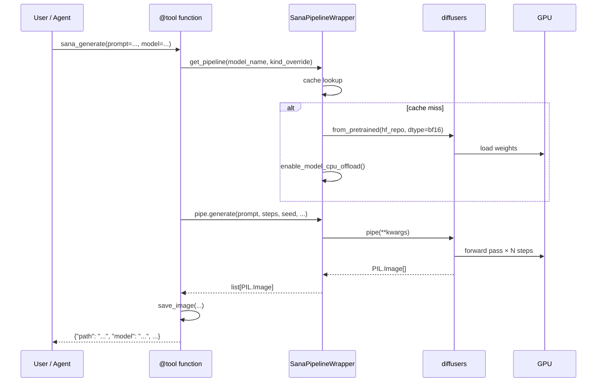
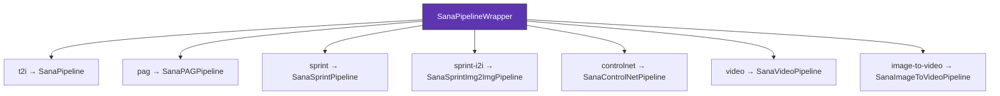
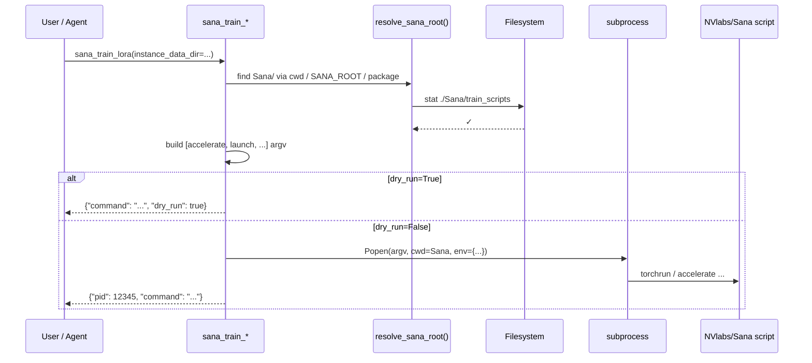

# Architecture

`strands-sana` is a thin agent-tool wrapper. The hard work is delegated to `diffusers` (inference) and upstream NVlabs/Sana scripts (training).

## Module layout

```
strands_sana/
├── __init__.py             # Public API: 33 @tool functions
├── tools/
│   ├── generate.py         # 13 core inference tools
│   ├── extras.py           # 10 extras (schedulers, quant, metrics, …)
│   ├── video.py            # 2 video tools
│   ├── img2img.py          # 1 img2img tool
│   └── training.py         # 7 training tools (subprocess to NVlabs/Sana)
├── pipeline/
│   └── sana_pipeline.py    # SanaPipelineWrapper — kind dispatch + caching
├── models/
│   └── registry.py         # 15 SanaModelInfo entries, list/filter helpers
└── utils/
    ├── io.py               # save_image, load_image, ensure_output_dir
    └── prompts.py          # COMPLEX_HUMAN_INSTRUCTION + style helpers
```

## Inference path



## Pipeline kinds



The `kind` is determined by:

1. `kind_override` argument (explicit)
2. `SanaModelInfo.pipeline_kind` (model registry)
3. `pag_scale > 0` upgrade (only for `t2i` → `pag`)

## Cache key

```python
key = f"{model_name}::{kind}::{device}"
```

So `(sana-1.6b-1024, t2i, cuda)` and `(sana-1.6b-1024, pag, cuda)` are separate entries — switching just flips the active pipeline class without re-downloading weights (where shared).

## Training path

Training is fundamentally different — we shell out:



Auto-resolves `Sana/` via:

1. Explicit `sana_root=` argument
2. `SANA_ROOT` env var
3. `./Sana` relative to cwd
4. Package-relative `../../Sana`

## Public API surface

33 `@tool` functions divided into 6 groups — see [API Reference](api-reference.md).

## What we don't do

- We don't vendor NVlabs/Sana research code — `diffusers` carries the inference; upstream Sana repo carries training scripts
- We don't reimplement scheduling — pulled from `diffusers`
- We don't ship checkpoints — auto-downloaded from HuggingFace on first use

This keeps the package small and ensures every Sana feature lands here as soon as upstream ships it.
