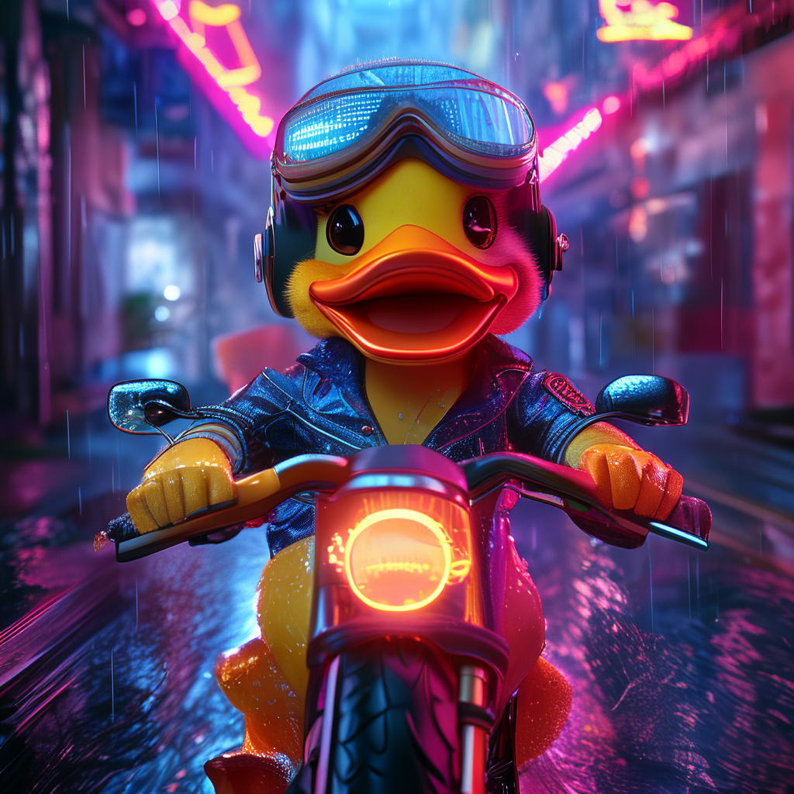
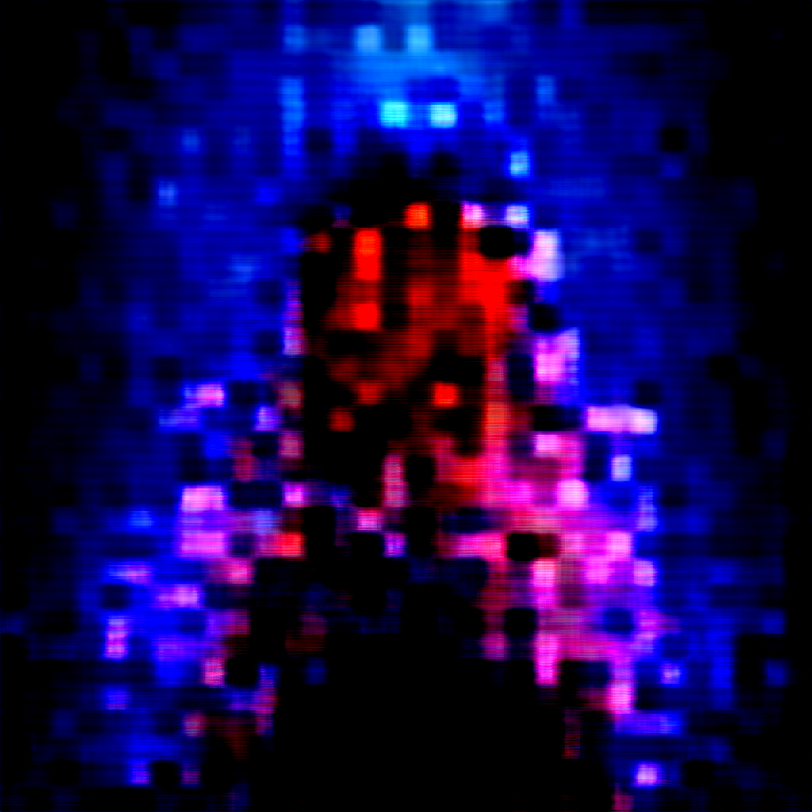
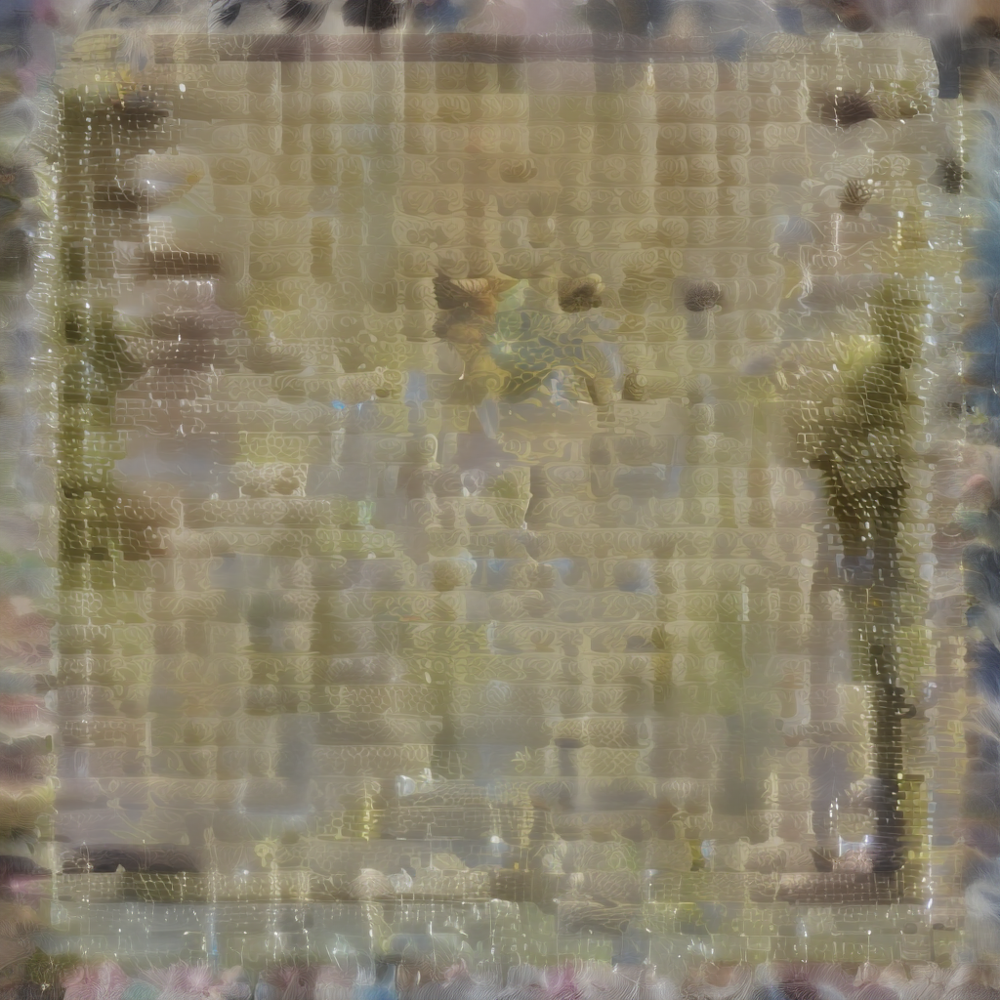
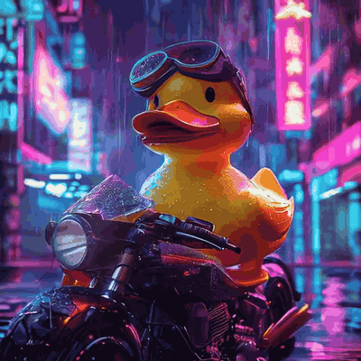
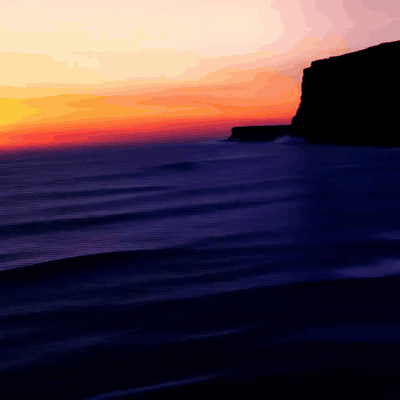
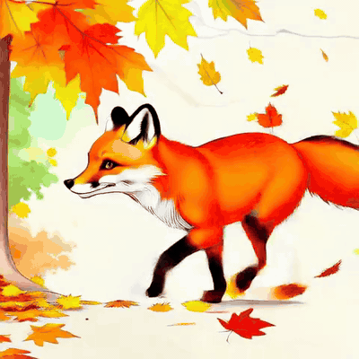
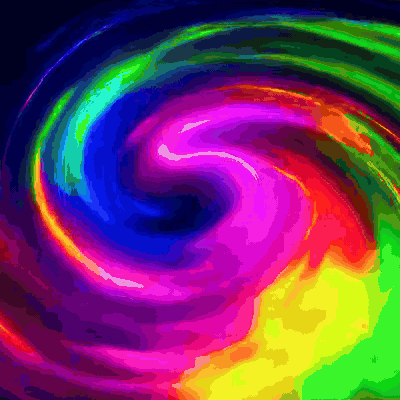

# Gallery

Every asset on this page was generated by `strands-sana` itself on an NVIDIA Thor dev kit (sm_110, CUDA 13).

---

## Hero — Sana 1.5 vs Sana-Sprint

Same prompt, same seed, vastly different cost.

<div class="compare-grid" markdown>
<figure markdown>
  
  <figcaption><strong>Sana-1.5 1.6B</strong><br/>20 steps · 6.4s</figcaption>
</figure>
<figure markdown>
  
  <figcaption><strong>Sana-Sprint 1.6B</strong><br/>2 steps · 0.6s</figcaption>
</figure>
</div>

```python
sana_generate(prompt=PROMPT, model="sana-1.5-1.6b-1024", steps=20, seed=42)
sana_sprint_generate(prompt=PROMPT, model="sana-sprint-1.6b-1024", steps=2, seed=42)
```

---

## PAG — Perturbed Attention Guidance

`pag_scale=2.0` boosts coherence at ~2× compute cost.

<p align="center">
  
</p>

```python
sana_generate(prompt=PROMPT, model="sana-1.5-1.6b-1024",
              pag_scale=2.0, steps=15, seed=42)
```

---

## Img2Img — restyle anything

Source image (left) restyled with two different prompts.

<div class="compare-grid" markdown>
<figure markdown>
  
  <figcaption>Source (Sana-1.5)</figcaption>
</figure>
<figure markdown>
  
  <figcaption>"anime cel-shaded style"<br/>strength=0.5</figcaption>
</figure>
<figure markdown>
  
  <figcaption>"oil painting, masterpiece"<br/>strength=0.6</figcaption>
</figure>
</div>

```python
sana_img2img(prompt="anime cel-shaded style",
             image_path="hero.png",
             strength=0.5, steps=2)
```

---

## Schedulers — same prompt, 4 schedulers

Sana is a flow-matching model, so `flow-match-euler` (default) is highest fidelity.
DPM-Solver also works well; non-flow schedulers degrade quality but generate quickly.

<div class="compare-grid" markdown>
<figure markdown>
  
  <figcaption><strong>flow-match-euler</strong><br/>(default · best fidelity)</figcaption>
</figure>
<figure markdown>
  
  <figcaption><strong>dpm-solver</strong><br/>(13× faster)</figcaption>
</figure>
<figure markdown>
  
  <figcaption><strong>euler</strong><br/>(lossy on flow models)</figcaption>
</figure>
<figure markdown>
  
  <figcaption><strong>ddim</strong><br/>(lossy on flow models)</figcaption>
</figure>
</div>

```python
sana_set_scheduler(name="dpm-solver", model="sana-0.6b-1024")
sana_generate(prompt=PROMPT, ...)
```

---

## Inference Scaling — 4 candidates, CLIP picks best

Generate N variants in parallel, score with CLIP, return the highest-aligned image.

<div class="compare-grid" markdown>
<figure markdown>
  
  <figcaption>seed 200<br/>CLIP 0.431</figcaption>
</figure>
<figure markdown>
  
  <figcaption>seed 201<br/>CLIP 0.453</figcaption>
</figure>
<figure markdown>
  
  <figcaption><strong>seed 202 — winner</strong><br/>CLIP 0.462</figcaption>
</figure>
<figure markdown>
  
  <figcaption>seed 203<br/>CLIP 0.459</figcaption>
</figure>
</div>

```python
sana_inference_scale(prompt=PROMPT, n_samples=4,
                     score_fn="clip", seed_start=200)
```

---

## Image-to-Video

Promote a still into a 49-frame clip.

<div class="compare-grid" markdown>
<figure markdown>
  
  <figcaption>Source PNG</figcaption>
</figure>
<figure markdown>
  
  <figcaption>49 frames · 24 fps</figcaption>
</figure>
</div>

```python
sana_image_to_video(image_path="hero.png",
                    prompt="zoom out, neon flickers",
                    frames=49, steps=10)
```

→ [Full MP4](assets/tool_image_to_video.mp4)

---

## SANA-Video — 3 aesthetics

<div class="compare-grid" markdown>
<figure markdown>
  
  <figcaption>Ocean waves crashing on cliffs</figcaption>
</figure>
<figure markdown>
  
  <figcaption>Watercolor fox running through autumn</figcaption>
</figure>
<figure markdown>
  
  <figcaption>Neon plasma swirling</figcaption>
</figure>
</div>

```python
for prompt in [...]:
    sana_video_generate(prompt=prompt, model="sana-video-2b-480",
                        frames=49, steps=10)
```

---

## Performance on Thor

| Tool | Model | Output | Time |
|------|-------|--------|-----:|
| `sana_generate` | sana-0.6b-512 | 512×512 PNG | 45.8s |
| `sana_generate` PAG | sana-1.5-1.6b-1024 | 1024×1024 | 62.6s |
| `sana_generate` (Sana-1.5) | sana-1.5-1.6b-1024 | 1024×1024 | 163s |
| `sana_sprint_generate` | sana-sprint-0.6b-1024 | 1024×1024 | 48.9s |
| `sana_img2img` | sana-sprint-i2i-1.6b-1024 | 1024×1024 | 9.3s |
| `sana_video_generate` (33 frames) | sana-video-2b-480 | 480p MP4 | 75.6s |
| `sana_video_generate` (97 frames) | sana-video-2b-480 | 480p MP4 | 102.6s |
| `sana_image_to_video` | sana-video-i2v-480 | 480p MP4 | 74.8s |
| `sana_inference_scale` (4×CLIP) | sana-0.6b-1024 | 4 PNGs + winner | 42.2s |

Times include first-load model loading (~22s for 0.6B, ~52s for 2B video).
