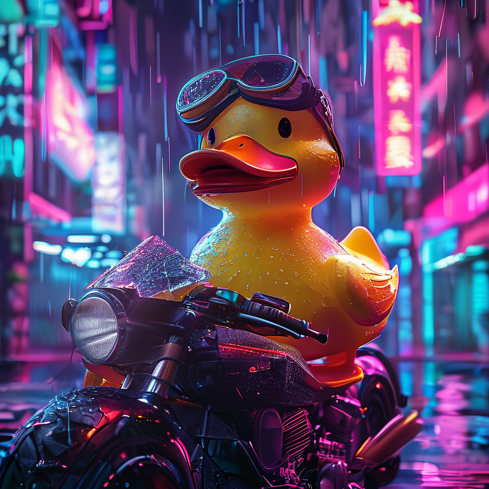

# Your first image

This walkthrough produces the hero image you see on the home page.

## Code

```python
from strands_sana import sana_generate

result = sana_generate(
    prompt=("a majestic rubber duck wearing aviator goggles, "
            "perched on a futuristic motorcycle in a cyberpunk neon-lit city, "
            "raining, photorealistic, 8k, dramatic cinematic lighting"),
    model="sana-1.5-1.6b-1024",
    steps=20,
    seed=42,
    output_dir="./out",
)
print(result)
```

## What happens

1. Pipeline cache miss → downloads `Efficient-Large-Model/SANA1.5_1.6B_1024px_diffusers` (~10 GB) on first run.
2. Loads the pipeline on best available device (`cuda` → `mps` → `cpu`).
3. Runs 20 denoising steps with `flow_match_euler` scheduler.
4. Saves PNG to `./out/sana_<timestamp>.png`.

```json
{
  "status": "success",
  "path": "./out/sana_1779038153007.png",
  "model": "sana-1.5-1.6b-1024",
  "kind": "t2i",
  "prompt": "...",
  "width": 1024,
  "height": 1024,
  "count": 1
}
```

## Result

<p align="center">
  
</p>

→ Want it 10× faster? See **[Sana-Sprint](../guide/sprint.md)**.
