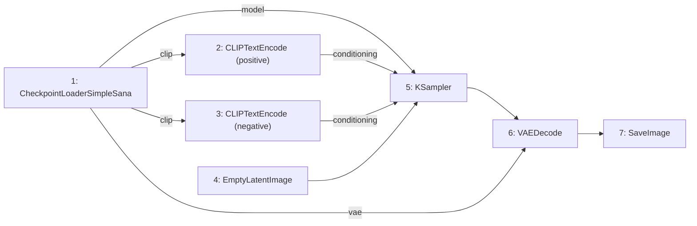

# ComfyUI Workflow Export

Generate a JSON workflow file you can drop into [ComfyUI](https://github.com/comfyanonymous/ComfyUI) (with the [Sana node pack](https://github.com/lawrence-cj/ComfyUI_ExtraModels)) to reproduce a `strands-sana` run as a visual graph.

```python
from strands_sana import sana_export_comfyui_workflow

sana_export_comfyui_workflow(
    prompt="a serene koi pond, ink wash painting",
    output_path="./koi_workflow.json",
    model="sana-1.6b-1024",
    width=1024, height=1024,
    steps=20, cfg=4.5, seed=1234,
)
# Open koi_workflow.json in ComfyUI → Load
```

## Generated graph



## Use cases

- 🎬 Hand off to artists who use ComfyUI
- 🔬 Reproduce a strands-sana run in a different ecosystem
- 🛠️ Visualize what your tool calls look like as a graph
- 📦 Build hybrid workflows (start in agent, finish in ComfyUI)

## Limitations

- The generated workflow is generic — doesn't include LoRA / ControlNet / scheduler swaps
- For full fidelity to a `strands-sana` run, log the JSON returned by each tool call
