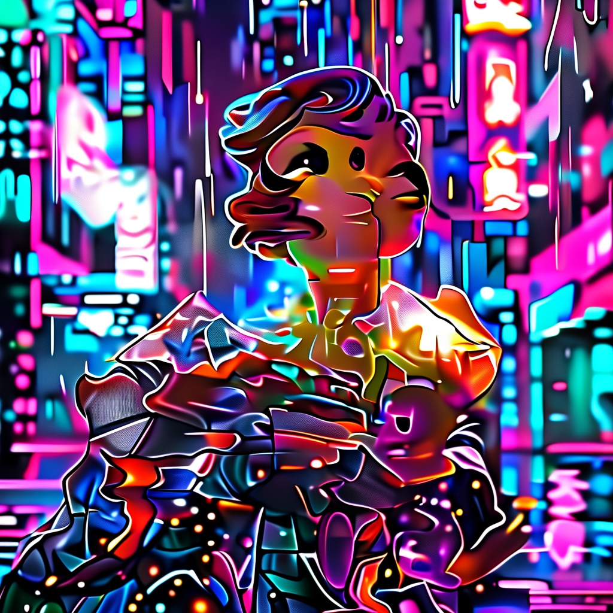
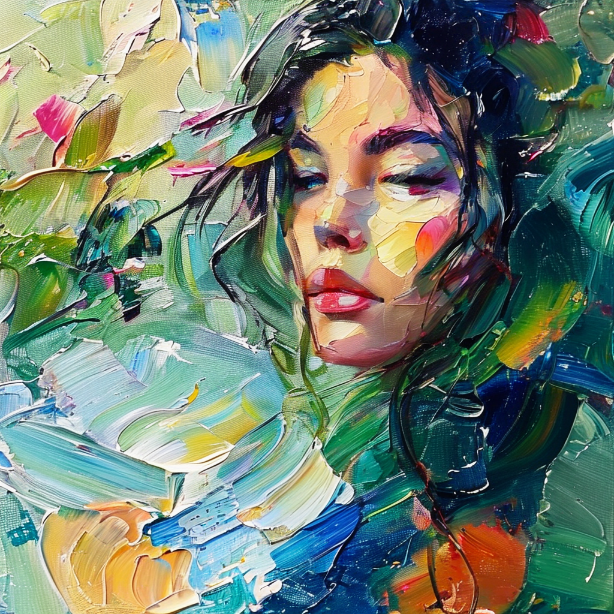

# Image-to-Image (`sana_img2img`)

Restyle an existing image at Sana-Sprint speed.

```python
from strands_sana import sana_img2img

sana_img2img(
    prompt="anime cel-shaded style, vibrant colors",
    image_path="source.png",
    model="sana-sprint-i2i-1.6b-1024",
    strength=0.6,    # 0..1: how much to change
    steps=2,         # Sprint sweet spot for img2img is 2-4
    seed=42,
)
```

## How `strength` works

| strength | effect |
|:---:|---|
| 0.0 | unchanged source |
| 0.3 | subtle restyle, preserves layout |
| 0.5 | balanced |
| 0.7 | strong reinterpretation |
| 1.0 | full regeneration (ignores source) |

## Demo

<div class="compare-grid" markdown>
<figure markdown>
  
  <figcaption>Source</figcaption>
</figure>
<figure markdown>
  
  <figcaption>strength=0.5<br/>"anime cel-shaded"</figcaption>
</figure>
<figure markdown>
  
  <figcaption>strength=0.6<br/>"oil painting"</figcaption>
</figure>
</div>

## Tips

- Sprint Img2Img doesn't accept `negative_prompt` or CFG (model is distilled)
- For more denoising control, use full Sana with manual init noise (advanced)
- 2 steps is fastest; 4 steps gives better fidelity
