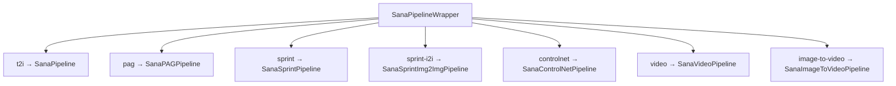

# Models

`strands-sana` registers **15 checkpoints** across **7 pipeline kinds**.

## List at runtime

```python
from strands_sana import sana_load_model

print(sana_load_model(model="list"))
print(sana_load_model(model="list", kind="video"))      # only video
print(sana_load_model(model="list", tag="sana-1.5"))    # only Sana-1.5
```

## Image models

| Alias | Pipeline | Resolution | Params | Use case |
|---|---|:---:|:---:|---|
| `sana-0.6b-512` | t2i | 512 | 590M | Fast iteration |
| `sana-0.6b-1024` | t2i | 1024 | 590M | Lightweight 1024 |
| `sana-1.6b-1024` | t2i | 1024 | 1.6B | **Default** |
| `sana-1.6b-multiling` | t2i | 1024 | 1.6B | Chinese/Emoji |
| `sana-1.5-1.6b-1024` | t2i | 1024 | 1.6B | Improved GenEval |
| `sana-1.5-4.8b-1024` | t2i | 1024 | 4.8B | Top quality |
| `sana-1.6b-2k` | t2i | 2048 | 1.6B | 2K resolution |
| `sana-1.6b-4k` | t2i | 4096 | 1.6B | 4K resolution |
| `sana-sprint-0.6b-1024` | sprint | 1024 | 590M | 1-2 step, ultra-fast |
| `sana-sprint-1.6b-1024` | sprint | 1024 | 1.6B | 1-2 step, top quality |
| `sana-sprint-i2i-1.6b-1024` | sprint-i2i | 1024 | 1.6B | Image-to-image |

## Video models

| Alias | Pipeline | Resolution | Frames | Use case |
|---|---|:---:|:---:|---|
| `sana-video-2b-480` | video | 480 | 121 | **Default 5s clip** |
| `sana-video-2b-720` | video | 720 | 121 | 720p with LTX-VAE |
| `longsana-2b-480` | video | 480 | 720 | Real-time minute-long |
| `sana-video-i2v-480` | image-to-video | 480 | 121 | Animate a still |

## Pipeline kinds



## Per-model defaults

Each model has tuned `default_steps`, `default_guidance`, `default_frames`. The wrapper uses these unless you override:

```python
from strands_sana.models import get_model_info

info = get_model_info("sana-sprint-1.6b-1024")
print(info.default_steps)     # 2 — Sprint sweet spot
print(info.default_guidance)  # 0.0 — distilled, no CFG
```

## Pre-download a checkpoint

```python
from strands_sana import sana_prefetch_model

sana_prefetch_model(model="sana-1.6b-1024")
# Returns: { "local_path": "~/.cache/huggingface/hub/..." }
```
