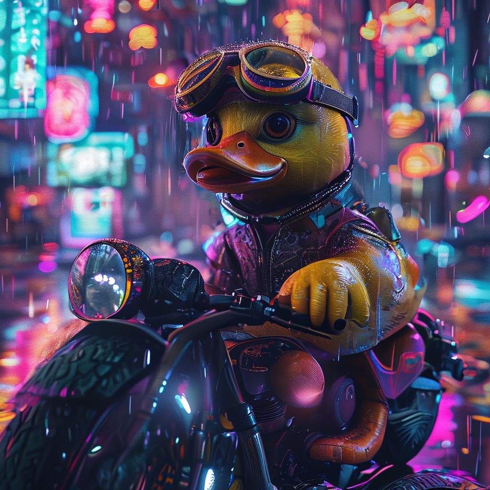

# Sana-Sprint

Distilled 1-2 step inference. ~0.1s per 1024px image on H100, ~0.3s on RTX 4090.

```python
from strands_sana import sana_sprint_generate

sana_sprint_generate(
    prompt="a cyberpunk hummingbird",
    model="sana-sprint-1.6b-1024",   # or sana-sprint-0.6b-1024
    steps=2,                          # sweet spot
    seed=42,
)
```

## How it works

Sprint uses **sCM-LADD distillation**:

- **sCM** — continuous-time consistency distillation
- **LADD** — Latent Adversarial Diffusion Distillation

The student model is trained to take giant denoising steps. Result: 1-2 steps gets the same quality as 20 steps of the teacher.

## Step count

Sprint accepts `steps` ∈ {1, 2, 4, 8, ...}.

| steps | speed | quality |
|:---:|---|---|
| 1 | fastest | sometimes blurry |
| **2** | **default** | **best balance** |
| 4 | slower | slight quality bump |
| 8 | slowest | diminishing returns |

!!! info "Implementation note"
    Sprint's `intermediate_timesteps=1.3` default is only valid for `steps=2`. The wrapper passes `intermediate_timesteps=None` automatically when `steps≠2`. (Caught by [BUG #5](../bugs-fixed.md).)

## Sprint Img2Img

Sprint's image-to-image variant uses the same checkpoint:

```python
from strands_sana import sana_img2img

sana_img2img(
    prompt="anime cel-shaded style",
    image_path="src.png",
    model="sana-sprint-i2i-1.6b-1024",
    strength=0.5, steps=2,
)
```

→ See [`sana_img2img`](img2img.md).

## Demo

Same prompt, same seed, two models:

<div class="compare-grid" markdown>
<figure markdown>
  
  <figcaption>Sana-1.5 1.6B<br/>20 steps · 6.4s</figcaption>
</figure>
<figure markdown>
  
  <figcaption>Sprint 1.6B<br/>2 steps · 0.6s</figcaption>
</figure>
</div>
