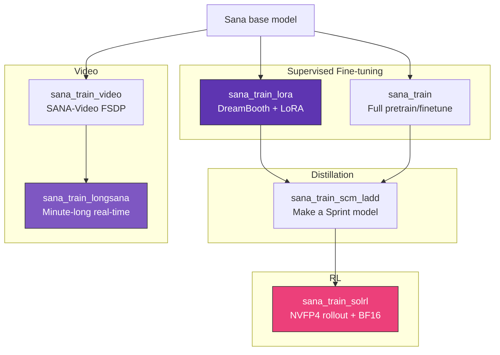

# Training

`strands-sana` exposes the full upstream training stack as `@tool` functions. All training tools shell out to NVlabs/Sana scripts via subprocess.

## Setup

You need the upstream Sana repo. Either:

```bash
git clone https://github.com/NVlabs/Sana.git    # auto-detected
```

Or:

```bash
export SANA_ROOT=/path/to/Sana
```

## Available training jobs

| Tool | Wraps | Use case |
|---|---|---|
| `sana_train_lora` | `train_dreambooth_lora_sana.py` | DreamBooth + LoRA |
| `sana_train` | `train_scripts/train.py` | Full pretrain / finetune |
| `sana_train_scm_ladd` | `train_scripts/train_scm_ladd.py` | Sana-Sprint distillation |
| `sana_train_solrl` | `sol_rl/run_sana_single_node_8gpu.sh` | RL post-training (NVFP4 + BF16) |
| `sana_train_video` | `train_video_ivjoint.py` | SANA-Video FSDP |
| `sana_train_longsana` | `train_longsana.py` | Real-time minute-long video |
| `sana_list_training_configs` | n/a | List 38 upstream configs |

## Dry-run first

All training tools default to `dry_run=True` — they print the command without launching.

```python
from strands_sana import sana_train_lora

result = sana_train_lora(
    instance_data_dir="./my-photos",
    instance_prompt="a photo of sks dog",
    max_train_steps=500,
    num_processes=4,
)
print(result["command"])
# accelerate launch --num_processes=4 train_scripts/train_dreambooth_lora_sana.py ...
```

## Launch for real

```python
result = sana_train_lora(..., dry_run=False)
print(result["pid"])  # background process started
```

The function returns immediately. Tail the logs at `output/<run-name>/`.

## Pipeline overview



## Example: LoRA on your own photos

```python
sana_train_lora(
    instance_data_dir="./photos-of-my-cat",
    instance_prompt="a photo of sks cat",
    validation_prompt="a photo of sks cat in a yarn art style",
    pretrained_model="Efficient-Large-Model/Sana_1600M_1024px_BF16_diffusers",
    resolution=1024,
    train_batch_size=1,
    gradient_accumulation_steps=4,
    learning_rate=1e-4,
    max_train_steps=500,
    use_8bit_adam=True,
    mixed_precision="bf16",
    seed=0,
    num_processes=4,
    push_to_hub=True,
    hub_repo="cagataycali/sana-cat-lora",
    dry_run=False,
)
```

15-20 photos and 500 steps is enough for DreamBooth. ~30 min on a single A100.

## Example: Sol-RL post-training

```python
sana_train_solrl(
    config_spec="configs/sol_rl/sana.py:sana_diffusionnft_pickscore",
    nproc_per_node=8,
    cuda_visible_devices="0,1,2,3,4,5,6,7",
    dry_run=False,
)
```

Sol-RL uses **NVFP4 rollout + BF16 training** for **4.6× faster RL convergence** than standard diffusion-RL methods.

## Example: video FSDP training

```python
sana_train_video(
    config_path="configs/sana_video_config/Sana_2000M_480px_AdamW_fsdp.yaml",
    num_processes=8,         # 8 GPUs
    chunk=False,              # set True for long-context training
    dry_run=False,
)
```

## List all configs

```python
from strands_sana import sana_list_training_configs

result = sana_list_training_configs()
for cfg in result["configs"]:
    print(cfg)
# 38 configs across sana_config, sana_sprint_config, sana_video_config, sol_rl, ...
```
