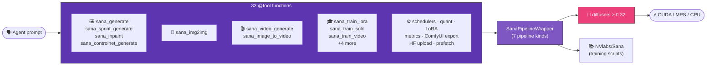

<div class="hero" markdown>
# strands-sana
<p class="subtitle">NVIDIA Sana <strong>inference + training</strong> as Strands Agent tools.<br/>
33 tools · 15 models · 7 pipelines · MP4 video · LoRA · ControlNet · Sol-RL.</p>
</div>

<p align="center">
  
  
</p>

<p align="center"><sub>
  <strong>Sana-1.5 1.6B</strong> (20 steps) vs <strong>Sana-Sprint 1.6B</strong> (2 steps) — same prompt, same seed.<br/>
  <em>"a majestic rubber duck wearing aviator goggles, perched on a futuristic motorcycle in a cyberpunk neon-lit city, raining"</em>
</sub></p>

<p align="center">
  
  
</p>
<p align="center"><sub>
  <code>sana_video_generate</code> — 5s sunrise · 2s cyberpunk teaser, 480p, generated on NVIDIA Thor
</sub></p>

---

## Why strands-sana?

```bash
pip install strands-sana
```

```python
from strands import Agent
from strands_sana import sana_generate, sana_video_generate

agent = Agent(tools=[sana_generate, sana_video_generate])
agent("Generate a cyberpunk cityscape at 1024px, then animate it as a 5s clip")
```

**That's it.** The agent picks the right model, sets sane defaults, downloads weights on first use, and saves outputs. All 33 tools work the same way.

---

## How it fits together



**Inference path** uses `diffusers` directly — fast, well-maintained, GPU-accelerated.
**Training path** shells out to upstream NVlabs/Sana scripts (auto-discovered).

---

## What you can do

<div class="grid cards" markdown>

-   **🖼️ Generate images**

    Sana 1.0 / 1.5 / Sprint, plus PAG, Inpainting, ControlNet, multi-image batches.

    → [Image generation](guide/image-generation.md)

-   **🎬 Generate videos**

    SANA-Video 480p / 720p / LongSANA. Text-to-video and image-to-video.

    → [Video generation](guide/video-generation.md)

-   **⚡ Sana-Sprint**

    1-2 step distilled inference. ~0.1s per 1024px image on H100.

    → [Sprint](guide/sprint.md)

-   **🎨 Image-to-image**

    Restyle existing images at Sprint speed.

    → [Img2Img](guide/img2img.md)

-   **🎓 Train your own**

    LoRA, full pretrain, sCM-LADD distillation, Sol-RL post-training, video FSDP.

    → [Training](guide/training.md)

-   **🔬 Inference scaling**

    Generate K candidates, pick best by CLIP / NVILA.

    → [Inference scaling](guide/inference-scaling.md)

-   **⚙️ Memory modes**

    Run 1.6B in 8 GB VRAM via int4/int8 quantization + offload.

    → [Memory & quantization](guide/memory.md)

-   **🔌 Schedulers**

    10 alias (flow-match-euler, DPM-Solver, Euler, DDIM, …) — swap at runtime.

    → [Schedulers](guide/schedulers.md)

-   **📊 Metrics**

    CLIPScore, ImageReward — score generations programmatically.

    → [Metrics](guide/metrics.md)

</div>

---

## Tested on real hardware

[](bugs-fixed.md)
[](https://github.com/cagataycali/strands-sana/tree/main/tests)

11 bugs were caught and fixed by stress-testing every tool on an NVIDIA Thor dev kit (CUDA 13). See the full [bug log](bugs-fixed.md).

→ Continue to **[Quickstart](getting-started/quickstart.md)** or browse the **[Gallery](gallery.md)**.
